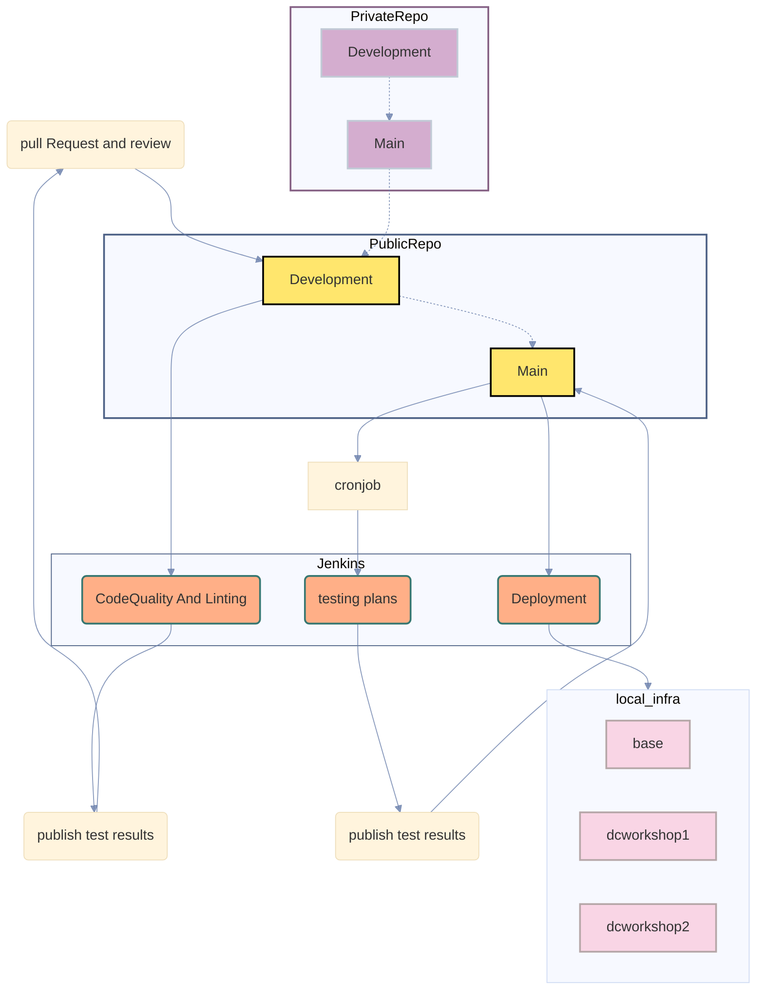

[](https://github.com/ji-podhead/Pod-Shop-App-Configs/actions/workflows/checkov.yml)
# Pod-Shop
 ***App-Configuration***

### CI-CD Pipeline

# 1.8.
- decided to use prereceive hooks and a second private repo to seal my code before review
  - bot will then automatically sync with main repo but unseal if all checks pass
  - therefore a few changes where required
- github server will be deployed using ansible
- proxmox cluster will also be getting deployed using ansible and further controlled trough terraform
  - i also added a new file structure using modules
## 22.7.

so we are currently trying to setup a git proxy that pushes the commit to a private repo, to get tested before any code/sensible data even be visible in our public repo. the reason was that i noticed that terraform and vault provider is kinda stupid and i dont want to leak any sensible data, so i decided to choose a zero trust approach for this....

- pre commit hook seals the code, sets up a pr and sends code to a private repo
- pull request and its sealed code awaits status check
- another hook pushes back into the pr including test results
- another review is required to unseal code in public pr

- added credentials to sign intoo private repo and process iac configuration checks in a private repo before pushing to publlic


## 16.7.
created automatic iac checks, pull request rules for status check approve and test result publishing integration

## 15.7.24

at the moment i use vault for key/val secrets. the thing with secrets is that you cant read/get gh actions secrets and i need at least one secret to access vault, to read all the other secrets. 
<br>
     ***the vault approle token secret either needs to be stored in `credentials.auto.tfvar`, or as gh-actions secret***

i want to keep my project as flexibel as possible so i decided to keep my terraform project structure and run it in gh actions, but dont put all the code in the workflow file

- this is somehow problematic because the project needs to be aware of how its deployed(manually, or via gh actions).
- therefore we need to check if the credentiuals.auto.tfvars file is existing, or if we need to get the vault secret via gitub 
- but terraform allows us to pass values via constructor like this:
```bash
$ terraform apply -var='vault_key=mein_sicherer_vault_key' -var='db_password=sicheres_passwort'
```
so we dont need to check if the credentifals file is existing.

***Do i need a vault gh actions workflow?***

no!<br>
we deploy via tailscale, so we dont. this is kinda tricky, but as i mentioned before: 
*I want to keep my project as flexible as possible*

***Do I need jenkins?***
im not really sure, but we can actually do our iac deployment without jenkins, but testing plans can profit from jenkins.
- *it actually doesnt matter because you can migrate from jenkins to git.*

 ---
